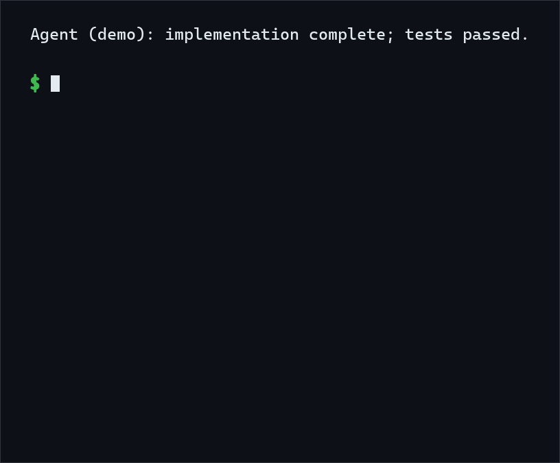
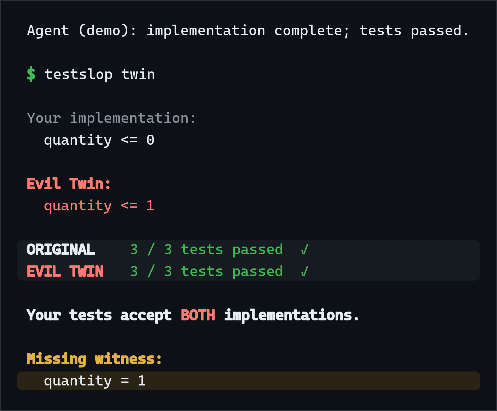
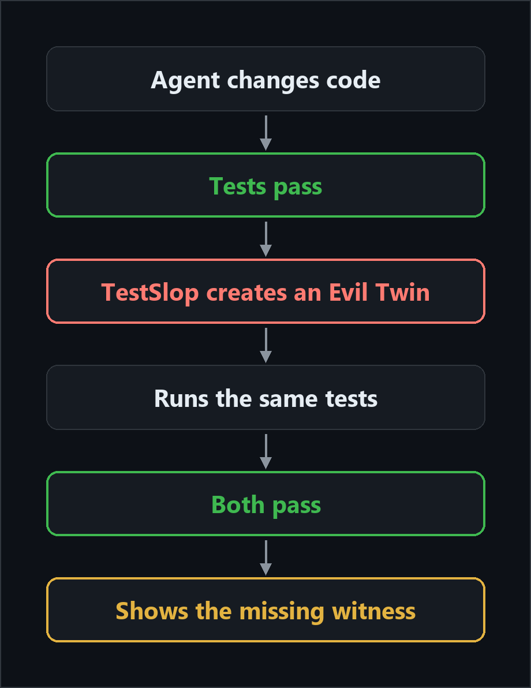
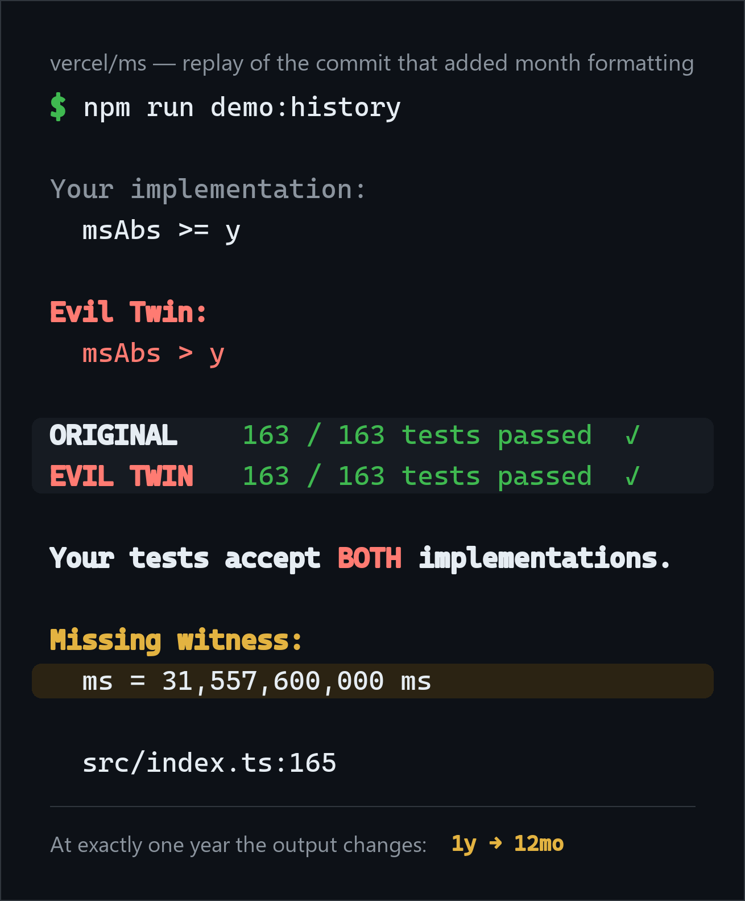

# TestSlop

**Your tests pass. So does the wrong code.**

<p align="center">
  
</p>

TestSlop finds one nearby implementation your tests also accept, then shows the input that separates it from your code.

## Try it locally

Install and run the built-in demo:

```bash
npm install
npm run build
npm run demo
```

TestSlop is not on npm; these commands run it from a local build.

`npm run demo` runs the quantity-boundary demo shown above. `npm run demo:history` runs the real `vercel/ms` replay shown below.

## Try it on a diff

Point TestSlop at the repository where your coding agent just finished:

```bash
node dist/cli.js twin --cwd /path/to/your/project
```

From the project itself, run `node dist/cli.js twin`. Link the build with `npm link` and the same command becomes `testslop twin`.

It compares the working tree with `HEAD`; use `--staged` for the index or `--base main` for a branch. Override test discovery with `--test-command "npm test"` when needed.

The default command checks nearby boundary comparisons and shows at most one Twin. Both versions run in disposable copies, and the report includes full-suite counts when the test runner prints them. The source tree is never edited.

If no suitable alternative is found, TestSlop says so plainly:

```text
No credible Evil Twin found for this diff.

The tests may be tight, or this change may not fit TestSlop's supported shapes.
No Twin found does not mean the code is verified correct.
```

## What is an Evil Twin?

An Evil Twin is a nearby implementation that behaves differently but still passes the same tests.

TestSlop builds one as a small, real code change near the diff under review, applies it in a disposable copy, and runs the tests. If both versions pass, it shows the pair and a missing witness: the simplest input the two implementations treat differently.

For example, `quantity <= 0` and `quantity <= 1` differ at `quantity = 1`. The report does not decide which implementation matches your product contract. It gives you a concrete place to look.

<p align="center">
  
</p>

## How it works

<p align="center">
  
</p>

Same tests, one nearby change, two implementations that both pass — and the input that would tell them apart.

## A real historical example

<p align="center">
  
</p>

During development, TestSlop found an exact-year boundary in the real [`ms` commit that added month formatting](https://github.com/vercel/ms/commit/3ba274e015722cbe1cdaa40f14f8c2954d8df0f3). The formatter tests checked one millisecond above a year, but not exactly one year.

Changing `msAbs >= y` to `msAbs > y` still passes the preserved suite — 163 of 163 tests on both versions. The missing witness is exactly one year: at `31,557,600,000` ms the output moves from `1y` to `12mo`.

Reproduce this focused historical replay offline:

```bash
npm run demo:history
```

The replay runs `npx vitest run --reporter=dot` with locked Vitest 3.2.4. The fixture preserves the upstream parent and commit source plus all four test files, and adapts only Jest's test-function import to the Vitest version already installed with TestSlop.

It does not download the upstream repository or claim that the change shipped as a bug.

## After an AI coding agent

Run TestSlop after the agent's own tests pass. You can add this tool-agnostic instruction to any `AGENTS.md`, Cursor rule, or team checklist:

> After implementation and tests are complete, run `testslop twin`. If it finds an Evil Twin, report the two expressions and the missing witness. A clean result does not prove correctness.

TestSlop does not start, supervise, or call a coding agent.

## Supported shapes

The attention-first command currently looks for high-confidence JavaScript and TypeScript boundary comparisons on changed production lines: `<`, `<=`, `>`, and `>=`, with a concrete input value or a simple named threshold.

It uses a nearby test runner detected from the project (`vitest`, `jest`, `mocha`, `ava`, `tape`, or `node --test`) or a `--test-command` override.

`testslop scan` remains available as a secondary static check. `testslop verify` is the advanced view for inspecting multiple alternatives and their execution outcomes.

## Limits

TestSlop searches a narrow set of nearby alternatives. A Twin is evidence that the current suite also accepts that alternate behavior; it is not automatically a bug.

The tool cannot infer every product contract, input domain, or reachability constraint. "No Twin found" can mean the tests are tight, the diff has no supported shape, or the bounded search did not generate the relevant case.

The test command runs with your normal user permissions inside a scratch copy. This protects the analyzed source from TestSlop's edits; it is not a security sandbox. TestSlop does not replace general-purpose mutation testing.

## Research archive

Three internal research phases rejected the broader verification-product claims. What remained interesting is the small developer-facing idea: a visible alternate implementation with a concrete witness.

The reports, evidence log, benchmark definitions, regression tests, and raw records stay in the repository for anyone who wants the history:

- [POC-00 report](docs/POC-00-REPORT.md)
- [POC-01 report](docs/POC-01-REPORT.md)
- [POC-02 report](docs/POC-02-REPORT.md)
- [Evidence log](docs/EVIDENCE-LOG.md)
- [Raw POC-02 records](corpus/poc02/raw/README.md)

Jev is omitted from v0.1. Twin selection is deterministic; there is no confidence score or automatic suppression.
